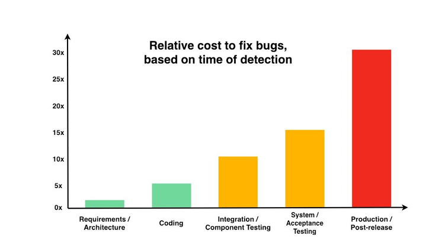
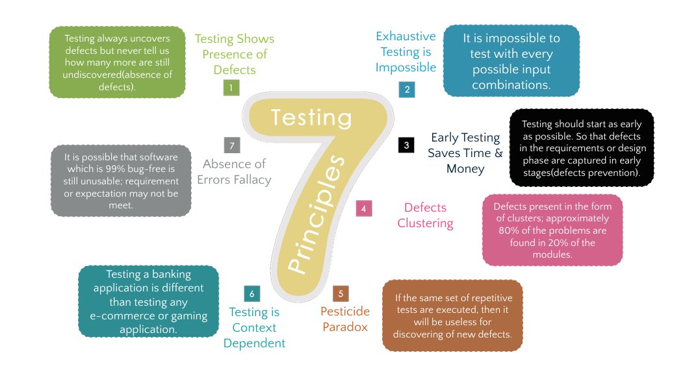
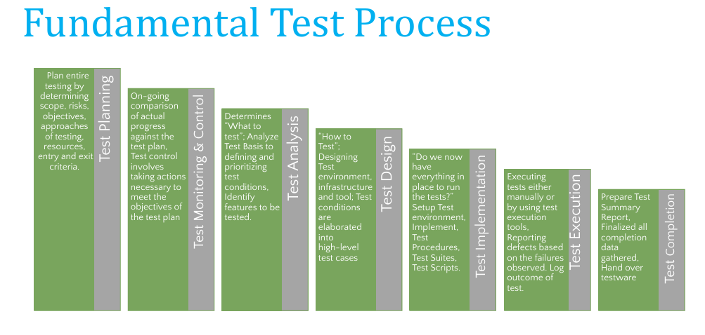
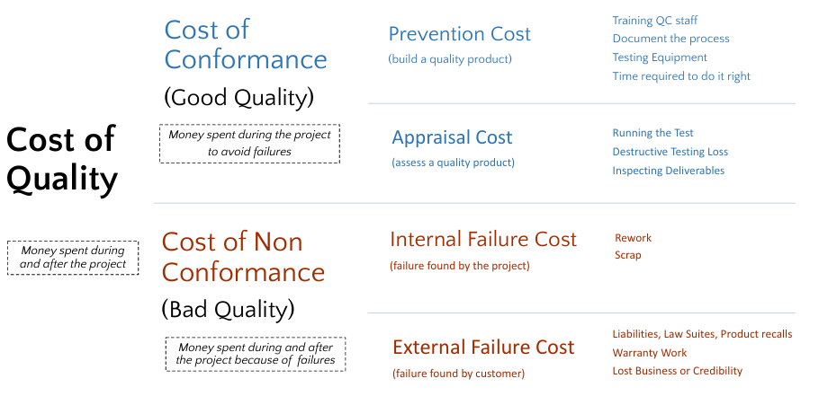

# Software Testing - Chapter 01: Fundamentals of Software Testing

## Table of Contents
1. What is Testing?
2. Why is Testing Necessary?
3. Quality vs Testing
4. Testing General Vocabulary
5. Testing Objectives
6. General Testing Principles
7. Test Process

---

## 1. What is Testing?

### Definition
Software testing is **a way to assess the quality of the software and to reduce the risk of software failure in operation.**

### Why Software Failures Matter
Most people have experienced software that did not work as expected. Software failures can lead to:
- **Loss of Money**
- **Loss of Time**
- **Damage to Business Reputation**
- **Injury or Death**

### Historical Evolution of Testing Definitions

**1979**: Software testing is a **process of executing a program or application** with the intent of finding **errors**.

**1983**: Testing is an **activity that measures** the Software Quality.

**2002**: Testing is a **concurrent lifecycle process** of engineering, using and maintaining testware in order to measure and improve quality of software being tested.

### Modern Definition
The **process of verifying and validating** that a software program, application, or product:
- Meets the business and technical requirements
- Works as expected (To Meet Expectation)

---

## 2. Why is Testing Necessary?

Software Testing is necessary because **we all make mistakes**. Some mistakes are unimportant, but some are **expensive** and **dangerous**.

### Key Principle
> "We need to check everything and anything we produce because things can always go wrong – humans make mistakes all the time."

---

## 3. Quality vs Testing

### What is Quality Software?

**Popular Definition**: 
"Quality software is reasonably bug or defect free, delivered on time and within budget, meets requirements and expectations, and is maintainable."

**ISO 8402-1986 Standard Definition**:
> "The totality of features and characteristics of a product or service that bears its ability to satisfy stated or implied needs."

### Two Views of Quality

1. **Popular View**: Quality is directly related to CLASS (luxury/prestige)
   - Example: Mercedes-Benz vs Suzuki Mehran

2. **Technical View**: Quality means meeting Customer Level of Satisfaction within Time, Budget, and Scope
   - Both Mercedes and Mehran can be "quality" products if they meet their respective customer expectations

### Relationship Between Testing and Quality

**"TESTING is the measurement of QUALITY"**

### Key Aspects of Quality
- **Good design** – looks and style
- **Good functionality** – it does the job well
- **Reliable** – acceptable level of breakdowns or failure
- **Consistent** – remain the same
- **Durable** – lasts as long as it should
- **Good after-sales service** - warranty
- **Value for money** – cost-effectiveness

### Cognition in Testing

Testing requires understanding **human cognition** and how users perceive and interact with systems. Good design considers cognitive psychology:
- **Less information, better design** (Google homepage example)
- **More information, poor design** (cluttered website example)
- **Visual hierarchy and clarity** matter

**Cognitive QA** connects quality to desired business outcomes; minimizing risk and rapidly delivering high quality 
software and products to market with optimal cost savings for an enhanced customer experience and a stronger 
brand reputation

---
### Cost of Defects



The cost of fixing defects increases exponentially through the development lifecycle:
- **Requirements/Architecture**: 1x (baseline cost)
- **Coding**: 5x
- **Integration/Component Testing**: 10x
- **System/Acceptance Testing**: 15x
- **Production/Post-release**: 30x

**Key Insight**: Early testing saves time and money!

---

## 4. General Testing Terms and Vocabulary

### Core Terminology

**Error/Mistake**: A human action that produces an incorrect result

**Defect/Fault/Bug**: A flaw in the code or document that may cause failure

**Failure**: The system not doing what it should do (or doing something it shouldn't)

### Relationship
> "A human being can make an **error (mistake)**, which produces a **defect (fault, bug)** in the program, code, or document. If a defect in code is executed, the system may **fail** to do what it should do (or do something it shouldn't), causing a **failure**."

**Note**: Defects in software, systems, or documents may result in failures, but not all defects do so.

### Testing Process Vocabulary

#### Planning and Strategy Documents

**Test Policy**: High-level document describing principles, approach, and major objectives of the organization regarding testing

**Test Strategy**: Documentation expressing generic requirements for testing one or more projects, aligned with test policy

**Test Approach**: Implementation of the test strategy for a specific project

**Test Plan**: Documentation describing test objectives, means, and schedule for achieving them

**Test Estimation**: Calculated approximation related to various testing aspects (effort, completion date, costs, number of test cases)

#### Analysis and Design

**Test Basis**: Body of knowledge used as the basis for test analysis and design

**Test Condition**: A feature, piece of functionality, or anything you intend to verify

**Test Analysis**: Activity that identifies test conditions by analyzing the test basis

**Test Design**: Activity of deriving and specifying test cases from test conditions

**Test Cases**: Set of preconditions, inputs, actions, expected results, and postconditions based on test conditions

**Test Script**: Sequence of instructions for test execution (Automated Code)

**Test Procedure**: Sequence of test cases in execution order, with associated setup and wrap-up activities

**Test Suite**: Set of test cases or test procedures to be executed in a specific test cycle
- **Test Suite = Test Procedure + Test Case**

**Test Data**: Data created or selected to satisfy execution preconditions and inputs

#### Execution and Environment

**Test Object**: Component or system to be tested

**Test Item**: Part of a test object used in the test process

**Test Objective**: Reason or purpose for designing and executing a test

**Test Oracle**: Source to determine expected results to compare with actual results

**Test Automation**: Use of software/script to perform or support test activities

**Test Environment**: Environment containing hardware, instrumentation, simulators, software tools, and other support elements needed to conduct a test

**Test Harness**: Test environment comprised of stubs and drivers needed to execute a test

**Testware**: Work products produced during the test process for use

**Test Input**: Data received from an external source during test execution

**Test Implementation**: Activity that prepares testware for test execution based on test analysis and design

**Test Execution**: Process of running a test, producing actual results

#### Reporting

**Test Progress Report**: Regular report about test progress against baseline, risks, and alternatives

**Test Summary Report**: Report providing evaluation of test items against exit criteria

### Process Flow
```
Test Basis → Test Condition → Test Case → Test Procedure → Test Implementation → 
Test Execution → Test Progress Report → Test Summary Report
```

---

## 5. Testing Objectives

Testing has multiple objectives beyond just finding bugs:

1. **Evaluate work products** such as requirements, user stories, design, and code
2. **Verify** whether all specified requirements have been fulfilled
3. **Validate** whether the test object works as users/stakeholders expect
4. **Build confidence** in the level of quality of the test object
5. **Prevent defects** (shift-left testing)
6. **Find failures and defects** in the system
7. **Reduce risk** of inadequate software quality
8. **Comply** with contractual, legal, or regulatory requirements
9. **Provide information** to stakeholders for informed decisions about quality

---

## 6. General Testing Principles

### The Seven Testing Principles



#### 1. Testing Shows Presence of Defects, Not Their Absence

Testing can show that defects are present but **cannot prove that there are no defects**. Testing reduces the probability of undiscovered defects but is not proof of correctness.

> "Testing always uncovers defects but never tells us how many more are still undiscovered (absence of defects)."

#### 2. Exhaustive Testing is Impossible

**It is impossible to test with every possible input combination** except for trivial cases. Rather than exhaustive testing, use:
- Risk analysis
- Test techniques
- Priorities to focus test efforts

#### 3. Early Testing Saves Time and Money

**Testing should start as early as possible** so that defects in requirements or design phase are captured early (defects prevention). This is sometimes called "**shift left**" testing.

Both static and dynamic test activities should start early in the software development lifecycle to reduce or eliminate costly changes.

#### 4. Defects Cluster Together

**Approximately 80% of problems are found in 20% of modules** (Pareto Principle). A small number of modules contains most defects discovered during pre-release testing or causes most operational failures.

Predicted and actual defect clusters are important input for risk analysis to focus test efforts.

#### 5. Beware of the Pesticide Paradox

**If the same set of repetitive tests are executed, they become useless for discovering new defects.** To detect new defects:
- Existing tests and test data may need changing
- New tests may need to be written

Tests are no longer effective at finding defects, just as pesticides are no longer effective at killing insects after prolonged use.

**Exception**: Automated regression testing benefits from this paradox through relatively low regression defects.

#### 6. Testing is Context Dependent

**Testing approaches differ based on context**. Testing a banking application is different from testing an e-commerce or gaming application. Different industries, regulations, and risks require different testing strategies.

#### 7. Absence-of-Errors is a Fallacy

**It is possible that software which is 99% bug-free is still unusable** if requirements or expectations are not met. Finding and fixing defects alone does not ensure system success.

---

## 7. Test Process

### Overview

A test process consists of seven main **groups of activities**:
```
Group → Activities → Sub Activities → Tasks
```

Tasks vary from one project or release to another.



### 7.1 Test Planning

**Purpose**: Plan the entire testing by determining scope, risks, objectives, and approaches.

#### Key Activities:
- Determine the **scope and risks**
- Identify the **objectives of testing**
- Determine the **test approach**
- Implement the **test policy** and/or **test strategy**
- Determine required **test resources** (people, test environments, PCs, etc.)
- **Schedule** test analysis, design, implementation, execution, and evaluation
- Determine **Entry and Exit criteria**

**Artifact/Work Product**: **TEST PLAN DOCUMENT**

### 7.2 Test Monitoring and Control

**Purpose**: Track progress and take corrective actions to meet test objectives.

#### Test Monitoring:
- On-going comparison of **actual progress** against the test plan
- Supported by evaluation of **exit criteria**
- Checking test results and logs against specified **coverage criteria**
- **Assessing quality level** based on test results and logs
- Determining if **more tests are needed**

#### Test Control:
- Taking actions necessary to **meet test plan objectives**
- Test progress communicated to stakeholders in **test progress reports**, including:
  - Deviations from the plan
  - Information to support decisions to stop testing

### 7.3 Test Analysis

**Purpose**: Determines "**what to test**"

#### Key Activities:
- Analyze **Test Basis** to define and prioritize test conditions for each feature
- Consider:
  - Functional characteristics
  - Non-functional characteristics
  - Structural characteristics
  - Business and technical factors
  - Risk levels
- **Identify features** and sets of features to be tested
- Capture **traceability** between test basis and test conditions
- May result in **discovery and reporting of defects** in test basis

### 7.4 Test Design

**Purpose**: Answers "**how to test?**"

#### Key Activities:
- **Elaborate test conditions** into high-level test cases and sets of test cases
- **Design and prioritize** test cases and sets of test cases
- Identify **necessary test data** to support test conditions and test cases
- **Design test environment** and identify required infrastructure and tools
- Capture **bi-directional traceability** between:
  - Test basis
  - Test conditions
  - Test cases

### 7.5 Test Implementation

**Purpose**: Answers "**do we now have everything in place to run the tests?**"

#### Key Activities:
- **Implement testware** necessary for test execution
- Implement **Test Procedures** and **Test Suites**
- Create automated **Test Scripts**
- **Prioritize and Schedule** Test Suites for execution
- **Setup test environment** and verify correct setup
- **Prepare test data** and ensure proper loading in test environment
- **Verify and update traceability** between:
  - Test basis
  - Test conditions
  - Test cases
  - Test procedures
  - Test suites

#### Key Definitions:

**Test Basis**: Body of knowledge used as the basis for test analysis and design

**Test Conditions**: A feature, piece of functionality, or anything you intend to verify

**Test Cases**: Set of preconditions, inputs, actions, expected results, and postconditions based on test conditions

**Test Procedures**: Sequence of test cases in execution order, with associated setup and wrap-up activities

**Test Suites**: Set of test cases or test procedures to be executed in a specific test cycle

### 7.6 Test Execution

**Purpose**: Run tests and record results

#### Key Activities:
- **Run test suites** according to test execution schedule
- **Record IDs and versions** of test items, test tools, and testware
- **Execute tests** manually or using test execution tools
- **Compare actual results** with expected results
- **Analyze anomalies** to establish likely causes
- **Report defects** based on failures observed
- **Log outcome** of test execution (pass, fail, blocked)
- **Re-execute test activities**:
  - **Confirmation Testing** (verify defect fixes)
  - **Regression Testing** (ensure no new defects introduced)

### 7.7 Test Completion

**Purpose**: Finalize testing activities and capture lessons learned

#### Key Activities:
- Collect data from **completed test activities**
- Activities occur at **project milestones**
- Check that **all defect reports are closed**
- Create **Test Summary Report** for stakeholders
- **Finalize and archive**:
  - Test environment
  - Test data
  - Test infrastructure (for later reuse)
- **Hand over testware** to:
  - Maintenance teams
  - Other project teams
  - Other stakeholders
- **Analyze lessons learned** to determine changes needed for:
  - Future iterations
  - Future releases
  - Future projects
- Use information to **improve test process maturity**

---

## 8. Cost of Quality




### Cost Structure

**Cost of Quality = Cost of Conformance + Cost of Non-Conformance**

#### Cost of Conformance (Good Quality)
Money spent **during the project to avoid failures**:

**Prevention Cost** (build a quality product):
- Training QC staff
- Documenting the process
- Time required to do it right

**Appraisal Cost** (assess a quality product):
- Testing Equipment
- Running the Test
- Destructive Testing Loss
- Inspecting Deliverables

#### Cost of Non-Conformance (Bad Quality)
Money spent **during and after the project because of failures**:

**Internal Failure Cost** (failure found by the project):
- Rework
- Scrap

**External Failure Cost** (failure found by customer):
- Liabilities, Lawsuits, Product recalls
- Warranty Work
- Lost Business or Credibility

### Key Insight
Investing in prevention and appraisal (good quality) is far less expensive than dealing with internal and external failures (bad quality).

---

## Summary of Key Concepts

1. **Testing Definition**: Process of verifying and validating software to ensure it meets requirements and works as expected

2. **Testing ≠ Quality**: Testing measures quality; quality is about meeting customer satisfaction within constraints

3. **Early Testing**: Saves time and money by catching defects when they're cheapest to fix

4. **Seven Principles**: Guide effective testing practices across all contexts

5. **Test Process**: Systematic approach with seven activity groups from planning to completion

6. **Vocabulary Matters**: Precise terminology ensures clear communication among testing professionals

7. **Cost of Quality**: Prevention and appraisal costs are investments that reduce expensive failure costs


## Exam Tips and Key Points to Remember

1. **Memorize the Seven Testing Principles** - frequently tested
2. **Understand the difference** between error, defect, and failure
3. **Know the Test Process sequence** and what each phase produces
4. **Remember cost escalation** - fixing defects costs 30x more in production
5. **Test early and often** - shift-left principle
6. **Quality definitions** - ISO standard vs. practical definition
7. **Testing shows presence, not absence** of defects
8. **Exhaustive testing is impossible** - use risk-based approaches
9. **Know testing vocabulary** - precise terminology is critical
10. **Understand traceability** throughout the test process

---
