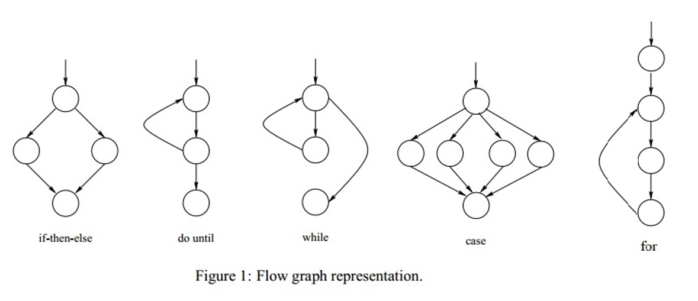
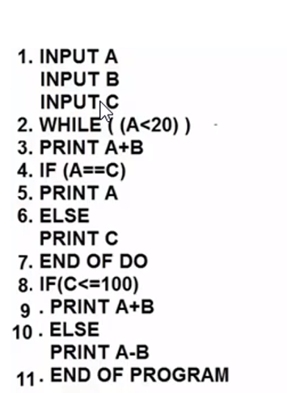
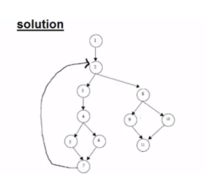
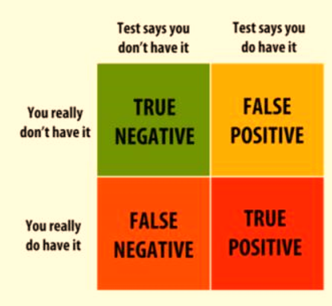
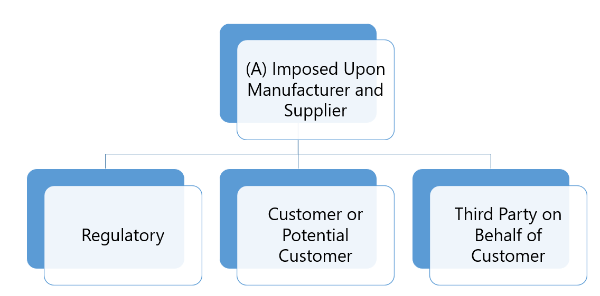
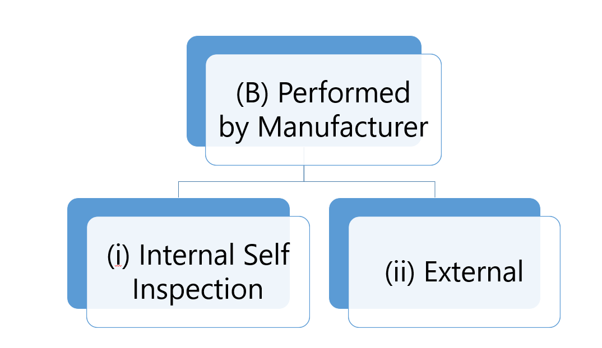
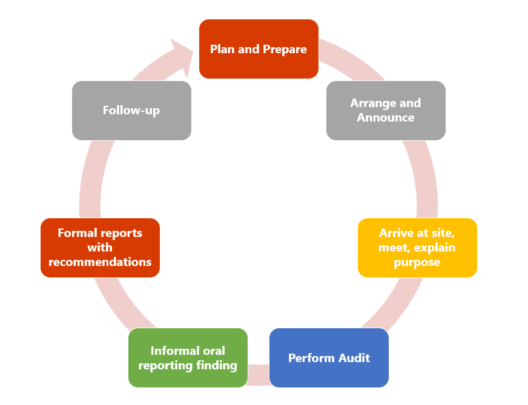

# CH03: Static Testing

## 1. What is Static Testing?

Static testing is the testing of software work products manually, or with a set of tools, where the software is **not executed**.

- **Timing:** It starts early in the Software Development Life Cycle (SDLC).
- **Purpose:** It uncovers errors that are often difficult or impossible to find during dynamic testing.
- **Requirement:** It does not require a computer to execute the program.
  - _Examples:_ Reviewing, Walkthroughs, Inspections.

## 2. Work Products Examined by Static Testing

Static testing can be applied to almost any document produced during the project, including:

- Specifications (SRS, FS, Security Requirements)
- Epics, User stories, and Acceptance criteria
- Architecture and Design Specifications
- Source Code
- Testware (Test plans, Test Cases, Test Procedures, Automated Scripts)
- User guides
- Web pages
- Contracts, Project Plans, Schedules, and Budgets

## 3. Static Testing – Identified Issues

Static testing can identify various types of defects, including:

- **Requirement defects:** Inconsistencies, ambiguities, contradictions, omissions, inaccuracies, and redundancies.
- **Design defects:** Inefficient algorithms or database structures, high coupling, low cohesion.
- **Coding defects:** Variables with undefined values, variables declared but never used, unreachable code, duplicate code.
- **Deviations from standards:** Lack of adherence to coding standards.
- **Incorrect interface specifications:** Mismatches such as different units of measurement between systems.
- **Security vulnerabilities:** Susceptibility to buffer overflows.
- **Traceability gaps:** Missing tests for acceptance criteria.

## 4. Benefits of Static Testing

- Detecting and correcting defects efficiently, prior to dynamic test execution.
- Identifying defects not easily found by dynamic testing.
- Preventing defects in design or coding by uncovering issues early.
- Increasing development productivity (improved design, maintainable code).
- Reducing development and testing cost and time.
- Reducing total cost of quality over the software’s lifetime.
- Improving communication between team members.

---

## 5. The Review Process

The review process comprises the following main activities:

1. Planning
2. Initiate Review
3. Individual Review
4. Issue Communication and Analysis
5. Fixing and Reporting

### 5.1 Planning

- Defining scope, purpose, documents to review, and quality characteristics.
- Estimating effort and timeframe.
- Identifying review characteristics (type, roles, activities, checklists).
- Selecting participants and allocating roles.
- Defining entry and exit criteria (for formal reviews).
- Checking that entry criteria are met.

### 5.2 Initiate Review

- Distributing the work product and materials (issue logs, checklists).
- Explaining scope, objectives, process, roles, and work products.
- Answering participant questions.

### 5.3 Individual Review

- Reviewing all or part of the work product.
- Noting potential defects, recommendations, and questions.

### 5.4 Issue Communication and Analysis

- Communicating identified potential defects (e.g., in a review meeting).
- Analyzing potential defects, assigning ownership and status.
- Evaluating and documenting quality characteristics.
- Evaluating findings against exit criteria to make a decision:
  - Reject
  - Major changes needed
  - Accept (possibly with minor changes)

### 5.5 Fixing and Reporting

- Creating defect reports for findings requiring changes.
- Fixing defects (typically done by the author).
- Communicating defects to the appropriate person.
- Recording updated status of defects.
- Gathering metrics (for formal reviews).
- Checking that exit criteria are met.
- Accepting the work product when exit criteria are reached.

---

## 6. Roles and Responsibilities in a Review

There are several key roles in a formal review process:

### Author

- Creates the work product under review.
- Fixes defects in the work product (if necessary).

### Management

- Responsible for review planning.
- Decides on the execution of reviews.
- Assigns staff, budget, and time.
- Monitors ongoing cost-effectiveness.
- Executes control decisions if outcomes are inadequate.

### Facilitator (Moderator)

- Ensures effective running of review meetings.
- Mediates between different points of view.
- Often the key person upon whom the success of the review depends.

### Review Leader

- Takes overall responsibility for the review.
- Decides who will be involved and organizes when/where it will take place.

### Reviewers

- May be subject matter experts, project members, or stakeholders.
- Identify potential defects.
- May represent different perspectives (tester, programmer, user, business analyst, etc.).

### Scribe (Recorder)

- Collates potential defects found during individual review.
- Records new potential defects, open points, and decisions during meetings.

---

## 7. Review Types

### Informal Review (Buddy Check, Pairing)

- **Main Purpose:** Detecting potential defects.
- **Additional Purposes:** Generating new ideas, quickly solving minor problems.
- **Characteristics:**
  - Not based on a formal (documented) process.
  - May not involve a meeting.
  - Results may be documented.
  - Use of checklist is optional.
  - Very commonly used in Agile development.

### Walkthrough

- **Main Purposes:** Find defects, improve product, consider alternatives, evaluate conformance to standards.
- **Characteristics:**
  - Individual preparation is optional.
  - Meeting typically led by the **author**.
  - Scribe is mandatory.
  - Use of checklists is optional.
  - May take the form of scenarios, dry runs, or simulations.

### Technical Review

- **Main Purposes:** Gaining consensus, detecting potential defects.
- **Characteristics:**
  - Reviewers should be technical peers of the author.
  - Individual preparation is **required**.
  - Review meeting is optional, ideally led by a trained facilitator (not the author).
  - Scribe is mandatory (ideally not the author).
  - Potential defect logs and review reports are typically produced.

### Inspection

- **Main Purposes:** Detecting defects, evaluating quality, preventing future defects via root cause analysis.
- **Characteristics:**
  - Follows a defined process with formal documented outputs.
  - Uses clearly defined roles (mandatory).
  - Individual preparation is required.
  - Reviewers are peers or experts.

---

## 8. Static Analysis

Static analysis is performed by tools to examine code without executing it. Key areas include:

- **Standard Compliance:** Ensuring code follows coding standards.
- **Code Metrics:** Measuring complexity and maintainability.
- **Data Flow Analysis:** Tracking data usage and variable states.

### Cyclomatic Code Complexity

A metric used to measure the complexity of a program. It is calculated based on the control flow graph.

**Formula:**
$$CC = E - N + 2P$$

- **E** = Number of Edges
- **N** = Number of Nodes (Shapes)
- **P** = Exit Paths

**Common Types of CC Graphs:**

## Example

**Paths:**

- Path 1: 1-2-8-9-11
- Path 2: 1-2-8-10-11
- Path 3: 1-2-3-4-5-7
- Path 4: 1-2-3-4-6-7

---

## 9. False Positive and False Negative

- **False Positive:** A test case fails, but there is actually no bug. The functionality is working correctly.
- **False Negative:** A test case passes, but there is a bug present. The functionality is not working as it should.

---

## 10. Quality Audits

### Definition

A systematic and independent examination to determine whether quality activities and related results comply with planned arrangements and whether these arrangements are implemented effectively.

**Goal:** To collect objective evidence to permit an informed judgment about the status of the systems or product.

### Basic Types of Quality Audits

1. **Internal (First Party, Self):** Audits by company employees, consultants, or contractors to its own company.
2. **External:**
   - **Second Party (Supplier Audit):** Customer employee(s) audit your company, or your employee(s) audit a supplier.
   - **Third Party (Independent Organization):** An external body audits the company (e.g., for ISO certification).

### Audit Sub-Types

- **Compliance:** Do we comply with the standard? (Example: Desk audit).
- **System:** The theory (Example: Audit of Document Control).
- **Process:** The practice (Example: Audit of manufacturing process).
- **Product:** The result (Example: Audit of finished products against specs).

### Who Performs Audits

### Reasons for Quality Audits

**Internal Reasons:**

- Determine level of compliance.
- Build confidence in the QA system.
- Build interdepartmental trust.
- Determine measures to improve (premises, equipment, personnel).
- Recommend corrective action (CAPA).

**External Reasons:**

- Establish/monitor supplier capability.
- Build mutual confidence.
- Promote understanding between parties.

### Quality Audit Steps

### Process Audits

Examination of:

1. Established methods
2. Instructions
3. Work flow for processes
4. Maintenance programs
5. Material handling
6. Housekeeping
